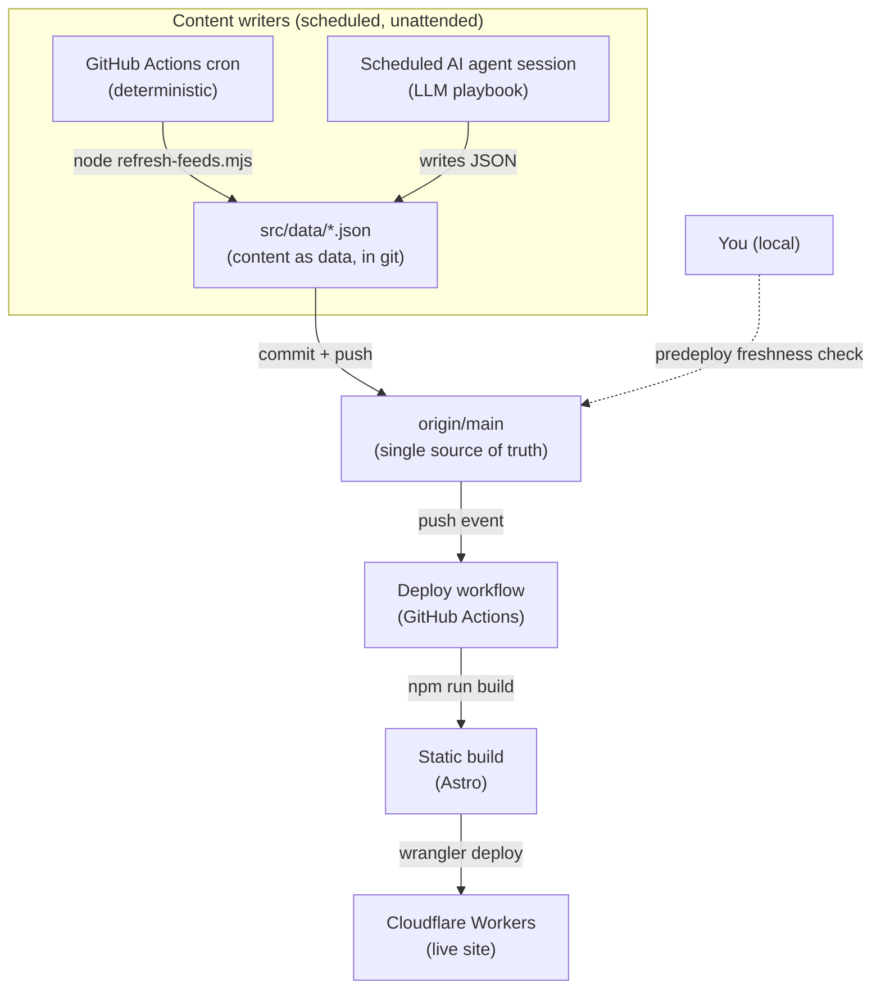

# Architecture: a self-maintaining, agent-updated content site

This document describes the architecture behind [joshw.us](https://joshw.us) as a
**reusable pattern**: a small content website that keeps itself up to date. Some
of its pages are refreshed by deterministic scheduled jobs; others are written
by an autonomous AI agent on a schedule. Everything is committed to git, and git
is the only source of truth — a push to `main` rebuilds and redeploys the site.

It is written so you can copy the pattern into your own public repo and adapt it.
The concrete file names below refer to the reference implementation, but nothing
here is specific to this site's subject matter.

---

## TL;DR

- **Content is data in git.** Pages are generated from JSON files in the repo, not
  from a database or a hosted CMS. Git history *is* the content history.
- **Two kinds of writers keep the data fresh:**
  1. a **deterministic** CI job (fetch RSS feeds → update JSON), and
  2. an **autonomous agent** (an LLM running a written playbook on a schedule to
     produce editorial content).
- **One source of truth.** Both writers commit to `main`. A push to `main`
  triggers a build + deploy to the edge. Whatever is on `main` is what's live.
- **The hard part is the guardrails,** not the happy path: making unattended
  writers safe, cheap, and unable to break the build or publish garbage. Most of
  this document is about those.

---

## System overview



The whole system is four moving parts:

1. A **static site generator** that turns JSON data into HTML at build time.
2. **Content-as-data** files in the repo.
3. **Scheduled writers** (one deterministic, one agentic) that update that data.
4. **Continuous deployment** that publishes `main` to the edge.

Plus the interesting fifth part: the **guardrails** that make 3 and 4 safe to run
with nobody watching.

---

## Core principles

1. **Git is the CMS.** Content lives as JSON in the repo. There is no external
   database to back up, migrate, or keep in sync. Rolling back content is
   `git revert`. Auditing "who changed what when" is `git log`.
2. **Content is data; rendering is a pure function of data.** Pages read the JSON
   at build time and render it. The same input always produces the same site.
3. **Two writer types, one contract.** A deterministic script and an autonomous
   agent both do the same job — mutate JSON and commit — so they share the same
   review surface (a diff) and the same deploy path.
4. **`main` is the single source of truth.** Nothing is "live" until it is on
   `main`. Deploys build from `main`, never from a developer's laptop state.
5. **Unattended means defensive.** Every automated step assumes it will run with
   nobody watching: it fails soft, caps its own cost, refuses to fabricate, and
   cannot take down the build on a bad day.

---

## Component 1 — Static site + edge host

**Stack:** [Astro](https://astro.build) (static output, TypeScript strict) →
[Cloudflare Workers](https://developers.cloudflare.com/workers/) via the
`@astrojs/cloudflare` adapter and `wrangler`.

Why this shape:

- **Build-time data loading.** Pages pull content with Astro's
  `import.meta.glob('../data/**/*.json')`, so the JSON is baked into static HTML
  at build. No runtime database calls, no per-request latency, trivially cacheable
  at the edge.
- **The build runs in CI, not on the Worker.** Image optimization and feed data
  are resolved on the CI runner; the Worker just serves the prerendered output.
- **`wrangler deploy` is the publish step.** The build artifact in `dist/` is
  uploaded to Cloudflare.

Key files: `astro.config.mjs`, `wrangler.jsonc`, `package.json` (`build` and
`deploy` scripts), `.nvmrc` (pins the Node version — see
[Guardrail: pin the toolchain](#g-toolchain)).

---

## Component 2 — Content as data

All editorial content is JSON under `src/data/`, with a matching TypeScript module
that is the **single source of truth for the schema** and the render helpers.

| Data | Written by | Schema / helpers | Rendered by |
|------|-----------|------------------|-------------|
| `src/data/reading.json` | deterministic feed refresh | (inline) | `src/pages/reading.astro` |
| `src/data/brief/<date>.json` | AI agent (daily) | `src/lib/brief.ts` | `src/pages/brief/[date].astro`, `latest.txt.ts` |
| `src/data/digest/<week>.json` | AI agent (weekly) | `src/lib/digest.ts` | `src/pages/digest/[week].astro` |
| `src/data/brief-sources.json` | human (curated) | — | consumed by the agent playbook |

Two conventions make this pleasant to work with:

- **One file per unit of content** (`brief/2026-06-30.json`), so concurrent
  writers rarely touch the same file and diffs stay legible.
- **The `lib/*.ts` module owns the types and the formatting/validation helpers**
  (date formatting, URL sanitizing, grouping). Pages never re-implement these, so
  agent-written data and hand-written data render through the same safe path.

---

## Component 3 — Deterministic automation (the feed refresh)

A GitHub Actions cron fetches every RSS/Atom feed listed in `reading.json` and
writes back the latest few items per source.

- **Workflow:** `.github/workflows/daily-reading-refresh.yml` — `schedule` (daily
  cron) + `workflow_dispatch` (manual). `permissions: contents: write` so it can
  commit.
- **Script:** `scripts/refresh-feeds.mjs` — pure Node, no framework. Reads the
  JSON, fetches each `feed`, writes up to N recent items back, updates a
  `lastRefreshed` timestamp, commits, and pushes.

This is the "easy" writer: fully deterministic, no model involved. But it is also
where several of the cost/reliability guardrails below live, because *fetching
arbitrary third-party feeds unattended* is exactly the kind of thing that hangs a
runner at 3 a.m.

---

## Component 4 — Agentic automation (brief + digest)

The editorial content is produced by an **LLM agent running a written playbook on
a schedule** — here, [Claude Code](https://claude.com/claude-code) sessions
triggered on a cron. The playbooks are plain Markdown in `.claude/commands/`:

- `daily-update.md` — the entry point. "Always write today's brief; on Sundays
  also write the weekly digest." It just delegates to the two below.
- `generate-brief.md` — produce `src/data/brief/<date>.json`: fetch and **verify**
  items from curated sources, de-duplicate against recent briefs, write a spoken
  script for text-to-speech, validate the build, commit, push.
- `generate-digest.md` — produce `src/data/digest/<week>.json`: rate the week's
  new reading-list articles, summarize, commit, push.

The important idea: **the playbook is the program.** It is a precise,
version-controlled spec of what the agent must do, including the safety contract
(next section). Because it is Markdown in the repo, it is reviewed and evolved
like any other code.

> A deterministic script and an agent playbook are interchangeable at the
> architecture level: both are "a scheduled process that mutates JSON and commits
> to `main`." That symmetry is what lets one CD pipeline serve both.

---

## Component 5 — Continuous deployment

- **Workflow:** `.github/workflows/deploy.yml` — triggers on `push` to `main`
  (and `workflow_dispatch`). Steps: checkout → set up Node from `.nvmrc` →
  `npm ci` → `npm run build` → `npx wrangler deploy`.
- **One secret:** `CLOUDFLARE_API_TOKEN` (repo secret) with Workers edit rights.
- **Concurrency group** so two deploys never race; the newest commit wins without
  cancelling an in-flight upload.

Because every writer pushes to `main`, and every push to `main` deploys, the
site converges to "whatever is on `main`" automatically.

---

## Guardrails and lessons learned

This is the part worth copying. Each guardrail exists because of a specific
failure mode that unattended automation *will* eventually hit.

### `main` is the source of truth — and a pre-deploy freshness check enforces it

`wrangler deploy` uploads local working-tree state; it does **not** pull from
GitHub. If you deploy from a laptop that is behind `origin/main`, you overwrite
live content that the bots committed while you weren't looking.

`scripts/predeploy-check.mjs` runs as the npm `predeploy` lifecycle hook: it
fetches `origin/main`, and if local is behind, it **blocks the deploy** and lists
the stale files. Escape hatch: `SKIP_DEPLOY_CHECK=1`. The CD pipeline is the
normal path; this only protects manual deploys.

### Concurrent writers → always rebase before push

Multiple unattended writers push to `main` (the feed bot, the brief agent, the
digest agent). Each commits then does `git pull --rebase origin main && git push`,
retrying a few times, so a concurrent push can't fail it with a non-fast-forward.
One-file-per-unit-of-content keeps these rebases conflict-free in practice.

### `GITHUB_TOKEN` pushes do **not** trigger other workflows

GitHub deliberately suppresses workflow triggers for pushes made with the default
`GITHUB_TOKEN`, to prevent recursive runs. So a commit made by a CI job (like the
feed refresh) will **not** trigger the deploy workflow, even though a normal push
would. Consequences and fixes:

- Symptom: data is updated on `main` but the live site doesn't change until some
  *other* (human-authored) push happens to trigger a deploy.
- Fix A (used here): the agent-authored brief/digest commits are made with a real
  user token, so those pushes *do* deploy — and they happen daily, pulling the
  feed data along with them.
- Fix B (explicit): have the CI writer dispatch the deploy itself after it
  commits, e.g. `gh workflow run deploy.yml --ref main` (this uses the API, which
  is **not** subject to the suppression rule) guarded by "only if something
  changed", with `permissions: actions: write`.

Pick one deliberately; don't assume "push triggers deploy" holds for bot commits.

<a id="g-toolchain"></a>
### Pin the toolchain, and keep the pin ahead of your dependencies

`.nvmrc` pins the Node version for both CI and local dev (`actions/setup-node`
reads it). This bit us: a dependency upgrade (Vite/Astro) began requiring a newer
Node API (`node:module.registerHooks`, Node ≥ 22.15) while `.nvmrc` still pinned
an older Node. Builds passed locally (newer Node) and failed in CI (older Node).
Keep the pin current and treat "CI Node" and "my Node" as the same thing.

### Cap every job's runtime (cost control)

GitHub Actions jobs default to a **6-hour** timeout. A single hung step can burn a
lot of minutes before it's killed. Every job sets an explicit
`timeout-minutes` (10 here) as a hard cost ceiling. This is the cheapest, highest-
leverage guardrail — add it to every workflow.

### Fetch defensively: real timeouts, bounded concurrency, no leaked handles

`refresh-feeds.mjs` fetches arbitrary third-party feeds, so it assumes any of them
can be slow, hostile, or hang forever:

- **Real aborts.** Each fetch uses an `AbortController` with a timeout, so a slow
  server's socket is actually torn down. (An earlier version raced a timeout
  promise but left the socket open — the process then stayed alive long after its
  work was done, and the runner hung for minutes. A timeout that doesn't *abort*
  isn't a timeout.)
- **Bounded concurrency** instead of sequential fetches, so total wall-clock is
  bounded by the slowest few, not the sum.
- **An overall deadline** for the whole fetch phase as a backstop.
- **Explicit `process.exit(0)`** at the end, so no lingering keep-alive handle can
  hold the runner open.
- **Fail soft.** A feed that fails keeps its previously cached items; the page
  never goes blank because one source had a bad day. The job still exits 0 — a
  flaky feed must never fail CI.
- **Surface systemic failure.** If a *majority* of feeds fail at once (a network
  or blanket-block problem, not one flaky source), emit a GitHub Actions
  `::warning::` annotation so it's visible instead of silently hiding behind
  "kept previous".

### Sanitize everything an agent writes before rendering it

Agent- (and feed-) authored content is untrusted input to your renderer. The
`lib/*.ts` helpers enforce this centrally:

- `safeUrl()` accepts only `http(s)` URLs and rejects `javascript:`, `data:`,
  relative, or malformed ones — so unattended content can't inject a script URL
  into an `href`.
- `escapeXml()` for anything rendered into the RSS/feed endpoints.
- Grouping/validation helpers put unexpected values into an "other" bucket rather
  than dropping them, so totals always reconcile and nothing vanishes silently.

Render agent output through the same validated path as everything else. Never
`set:html` raw model output.

### Give the agent a hard content contract: never fabricate, never repeat

The brief playbook encodes two non-negotiable rules that make unattended
generation trustworthy:

- **Never fabricate.** Every fact must come from a source fetched and verified
  *this run*, with a real working link. If it can't be verified, it's left out. A
  shorter, fully grounded brief beats a padded one. If nothing can be verified,
  write a one-line "couldn't source today" and stop — do not invent.
- **Never repeat.** Read the last N outputs first and exclude anything already
  covered. This keeps a daily generator from rehashing itself.

These belong in the playbook because they are the difference between "an agent
that writes a real briefing" and "an agent that hallucinates plausibly."

### Keep dependencies current and boring

Automated dependency updates (Dependabot) plus `npm audit` keep the supply chain
patched. Because the deploy is fully automated, a broken dependency surfaces as a
red deploy immediately — so it's worth validating dependency bumps (`npm ci &&
npm run build`) before merging, especially given the toolchain-pinning lesson
above.

---

## The content loops, end to end

**Deterministic loop (daily):**

```
cron → refresh-feeds.mjs → fetch feeds (fail-soft) → write reading.json
     → commit + push (GITHUB_TOKEN) → [deploy: see GITHUB_TOKEN caveat]
```

**Agentic loop (daily / weekly):**

```
cron → agent session runs daily-update.md
     → generate-brief.md: fetch+verify sources, de-dupe, write brief/<date>.json
        → npm run build (must pass) → commit + push (user token) → deploy → live
     → (Sundays) generate-digest.md: rate week's articles, write digest/<week>.json
        → build → commit + push → deploy → live
```

**Human loop (occasional):**

```
edit locally → npm run dev → commit → push → predeploy freshness check → deploy
```

---

## Build your own — a checklist

1. **Pick a static generator with build-time data loading** (Astro here; Eleventy,
   Next static export, Hugo all work). Ensure pages can read local JSON at build.
2. **Model content as JSON, one file per unit,** and put the schema + render
   helpers in one typed module you control.
3. **Host somewhere that deploys from a build artifact** (Cloudflare Workers/Pages,
   Netlify, GitHub Pages). Wire "push to `main` → build → deploy" in CI.
4. **Add the deterministic writer** as a small Node script + a cron workflow with
   `contents: write`. Make it fail-soft and abort-on-timeout from day one.
5. **Add the agentic writer** as a Markdown playbook run by a scheduled agent.
   Bake in the never-fabricate / never-repeat contract and "validate the build
   before committing."
6. **Add the guardrails before you need them:** `timeout-minutes` on every job,
   a pre-deploy freshness check, `safeUrl`-style sanitizing, rebase-on-push, and
   a deliberate answer to the `GITHUB_TOKEN`-doesn't-trigger-deploys question.
7. **Pin your toolchain** (`.nvmrc`) and keep it ahead of your dependencies.

---

## Reference file map

```
.
├── .github/workflows/
│   ├── deploy.yml                    # push to main → build → wrangler deploy (timeout-capped)
│   └── daily-reading-refresh.yml     # cron → refresh feeds → commit (timeout-capped)
├── .claude/commands/                 # the agent playbooks (the "programs")
│   ├── daily-update.md               #   entry point (brief daily; digest Sundays)
│   ├── generate-brief.md             #   daily brief: verify-or-omit, never repeat
│   └── generate-digest.md            #   weekly digest: rate + summarize
├── scripts/
│   ├── refresh-feeds.mjs             # deterministic writer: abort-on-timeout, fail-soft
│   └── predeploy-check.mjs           # blocks deploying stale local state over bot commits
├── src/
│   ├── data/                         # content as data (git is the CMS)
│   │   ├── reading.json              #   feed sources + cached latest items
│   │   ├── brief/<date>.json         #   one file per daily brief
│   │   ├── digest/<week>.json        #   one file per weekly digest
│   │   └── brief-sources.json        #   curated sources the agent must verify
│   ├── lib/
│   │   ├── brief.ts                  # brief schema + safe render helpers
│   │   └── digest.ts                 # digest schema + safeUrl/escapeXml/grouping
│   └── pages/                        # render JSON → HTML at build time
├── astro.config.mjs                  # site + Cloudflare adapter
├── wrangler.jsonc                    # Workers config
└── .nvmrc                            # toolchain pin (keep ahead of deps)
```

---

*Reference implementation: [joshw.us](https://joshw.us). This document describes
the pattern; adapt the specifics to your own content and host.*
